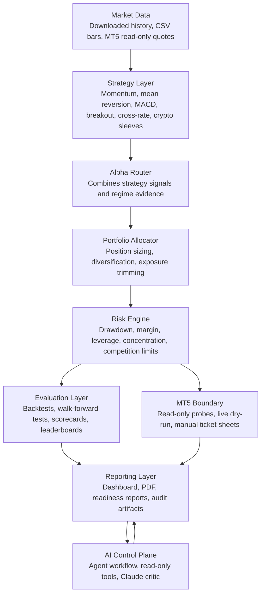

# Claude Agent Trader

Claude Agent Trader is an AI-native FX and crypto trading research system built for a competitive paper-trading hackathon. It combines strategy research, portfolio backtesting, risk discipline, MT5 readiness, dashboards, and an Anthropic/Claude critic layer into one reproducible workflow.

The project is not a black-box trading bot. It is a controlled research and deployment system: deterministic Python modules generate signals, evaluate portfolios, and enforce risk limits, while AI agents inspect evidence, critique overfitting, review safety, and package judge-ready reports.

## What It Does

- Researches and compares FX, metals, and crypto trading strategies.
- Runs single-symbol, multi-symbol, portfolio, and walk-forward backtests.
- Routes strategy signals through an alpha router and portfolio allocator.
- Enforces exposure, drawdown, margin, asset-class, and competition-risk controls.
- Produces dashboards, reports, scorecards, PDFs, and deployment-readiness evidence.
- Prepares for MT5 integration through read-only probes, live dry-runs, and manual ticket sheets.
- Uses Claude through the Anthropic SDK as a guarded critic agent for strategy quality, overfitting risk, and live-trading safety.

## Why It Is AI-Native

Claude Agent Trader uses AI as part of the research and governance loop, not as an unrestricted order sender. The agent layer can inspect project artifacts, summarize backtest evidence, review risk discipline, challenge weak assumptions, and prepare judging material.

The Anthropic/Claude critic has a deliberately narrow role:

- It reviews evidence produced by the trading system.
- It critiques overfitting, risk controls, and competition-readiness claims.
- It has no MT5 credentials.
- It has no broker or order-placement authority.
- It cannot promote a strategy without the deterministic backtest and risk gates.

This creates a hybrid AI/quant architecture where AI improves judgment, but hard software guardrails control execution risk.

## Architecture



## Main Layers

**1. Data and Broker Boundary**

Historical backtest data is normalized into project-friendly CSV files. MT5 support is intentionally staged: first read-only quote/account probes, then live dry-run monitoring, and only later explicitly armed execution.

**2. Strategy Research**

The strategy layer contains multiple alpha ideas rather than relying on a single signal. It includes trend-following, reversion, cross-rate, volatility, and crypto-aware components so the portfolio can behave differently across market regimes.

**3. Router and Portfolio Allocation**

The alpha router combines strategy outputs. The portfolio allocator then converts desired trades into safer targets by limiting concentration, leverage, asset-class exposure, and net directional exposure.

**4. Risk and Competition Discipline**

The risk engine is designed around hackathon survival. It blocks or trims trades when drawdown, daily loss, margin, concentration, or internal safety limits are breached.

**5. Backtesting and Evaluation**

The evaluation layer replays historical data through strategy, routing, allocation, risk, and simulated fills. It produces metrics such as P&L, drawdown, Sharpe-like scores, win rate, exposure, and fold-level robustness.

**6. AI Control Plane**

Agents use read-only tools to inspect evidence and produce reports. Claude acts as an independent critic for strategy validation, overfitting detection, risk review, and presentation quality.

## Important Commands

Install the local project:

```bash
python3.11 -m venv .venv
source .venv/bin/activate
python -m pip install -e .
```

Run the test suite:

```bash
python -m unittest discover -s tests
```

Run live-style dry-run checks:

```bash
quanthack live-dry-run --adapter csv --symbol EURUSD
quanthack mt5-probe --symbol EURUSD
```

Build the technology-prize PDF:

```bash
python scripts/reporting/build_technology_walkthrough_pdf.py
```

The public project name is Claude Agent Trader. The internal Python package and command prefix remain `quanthack` for compatibility with the existing codebase.

## PDF Walkthrough

The technology walkthrough PDF is included here:

`output/pdf/claude_agent_trader_technology_walkthrough.pdf`

## Safety Notice

This project is for a paper-trading hackathon and research demonstration. It is not financial, investment, legal, tax, or real-money trading advice. Official competition rules and broker controls override project notes whenever they differ.
