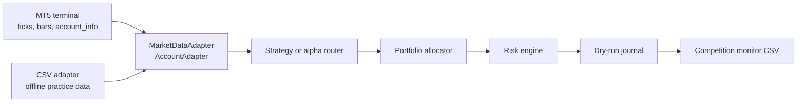

# MT5 Read-Only Live Dry-Run

This step adds the first MT5-shaped seam without allowing real orders.

MT5, or MetaTrader 5, is the trading terminal used by many FX and CFD brokers.
For this project we use it as a read-only bridge:

- read latest bid/ask ticks;
- read recent OHLC bars;
- read account equity and margin level;
- never call `order_send`;
- never place paper or live trades from this command.

The loop still writes only local QuanHack outputs:

- `outputs/live_dry_run_journal.jsonl`
- `outputs/live_competition_monitor.csv`

## Architecture



## New Code

- `src/quanthack/market/adapters.py`
  - `CsvMarketDataAdapter`
  - `MT5MarketDataAdapter`
  - `MT5AccountAdapter`
  - `StaticAccountAdapter`
- `src/quanthack/trading/live_dry_run.py`
  - loops through live-style data snapshots;
  - builds symbol intents;
  - applies allocation and risk;
  - writes dry-run execution records.
- `src/quanthack/trading/competition_monitor.py`
  - tracks live equity, leverage, concentration, directional exposure, Sharpe
    observation count, and risk-discipline status.
- `src/quanthack/cli/live_dry_run.py`
  - command-line entry point.

## Start With CSV

Use CSV first. It exercises the exact same strategy, allocator, risk, journal, and
monitor path without needing MT5 installed.

In VS Code terminal:

```bash
cd ~/Desktop/quanthack
source .venv/bin/activate
python -m pip install -e .
quanthack live-dry-run \
  --adapter csv \
  --strategy simple_momentum \
  --symbol EURUSD \
  --bars 5 \
  --iterations 1
```

That command uses the default tiny CSV files, so it is a connectivity and monitor
check more than a strategy-quality check.

For a multi-symbol practice run, generate richer local data first:

```bash
quanthack generate-sample-data \
  --symbol EURUSD \
  --symbol USDJPY \
  --periods 64 \
  --price-output data/live_practice_prices.csv \
  --quote-output data/live_practice_quotes.csv

quanthack live-dry-run \
  --adapter csv \
  --strategy simple_momentum \
  --symbol EURUSD \
  --symbol USDJPY \
  --bars 20 \
  --iterations 1 \
  --price-csv data/live_practice_prices.csv \
  --quote-csv data/live_practice_quotes.csv
```

Then inspect the result:

```bash
quanthack show-journal --journal outputs/live_dry_run_journal.jsonl --limit 10
quanthack show-positions --journal outputs/live_dry_run_journal.jsonl
quanthack journal-summary --journal outputs/live_dry_run_journal.jsonl
```

Open this CSV in VS Code or Excel:

```text
outputs/live_competition_monitor.csv
```

The monitor CSV is the live-demo checkpoint. It tells you whether the dry-run
portfolio is staying within the hackathon risk shape:

- equity;
- daily P&L;
- drawdown;
- gross and net notional;
- leverage;
- margin usage estimate;
- largest-symbol concentration;
- net directional exposure;
- accepted dry-run trade count.

The CLI also prints requested gross exposure and adjusted gross exposure. Requested
means what the strategy wanted; adjusted means what survived portfolio allocation
and risk guardrails.

If allocation or a strategy targets a symbol to flat, the loop still asks the
risk engine for an exit decision before writing the journal record. Exits are
approved as exposure-reducing actions, but the journal keeps the risk state and
reason for audit.

Market-quality holds are also journaled. If a quote is too old, future-dated, or
has a spread wider than the configured limit, the loop writes a blocked dry-run
record with the hold reason. That makes data-feed degradation visible in the
same audit trail as accepted and risk-blocked trade decisions.

Transient polling failures are journaled too. If MT5 or the account adapter fails
on one iteration because a tick, bar, or account snapshot is temporarily
unavailable, the loop writes a blocked dry-run record with a
`live dry-run polling failure` reason and continues to the next poll. This is a
competition survival guard: one bad read should not turn into hours of inactivity.

## Run A Strategy Map

`live-dry-run` can also run a per-symbol strategy map. Symbols not listed in
`--strategy-map` use the fallback from `--strategy`.

Current static paper-backup shape:

```bash
quanthack live-dry-run \
  --adapter csv \
  --strategy champion_ensemble \
  --strategy-map XAUUSD=macd_momentum \
  --strategy-map AUDUSD=macd_momentum \
  --strategy-map USDCHF=macd_momentum \
  --strategy-map EURUSD=macd_momentum \
  --symbol XAGUSD --symbol XAUUSD --symbol AUDUSD --symbol USDCHF --symbol EURUSD \
  --price-csv data/full_20gb_15m_prices.csv \
  --quote-csv data/full_20gb_15m_quotes.csv \
  --bars 120 \
  --iterations 1
```

The command prints the resolved strategy map before running. With `--adapter mt5`
the same map is still read-only unless a separate live execution route is built
and explicitly armed.

## Run A Deployment Profile

After building `outputs/research/deployment_profile_pack.json`, `live-dry-run`
can load one exact profile slot. This avoids manually copying strategy maps,
symbol multipliers, and crypto session gates into the command line.

CSV rehearsal:

```bash
PYTHONPATH=src .venv/bin/python \
  -c 'from quanthack.cli.live_dry_run import main; main()' \
  --config configs/competition.toml \
  --adapter csv \
  --profile-pack-json outputs/research/deployment_profile_pack.json \
  --profile-slot conservative \
  --price-csv data/mixed_official_crypto_proxy_overlap_prices.csv \
  --quote-csv data/mixed_official_crypto_proxy_overlap_quotes.csv \
  --journal outputs/research/profile_live_dry_run_journal.jsonl \
  --monitor-output outputs/research/profile_live_monitor.csv \
  --allocation-output outputs/research/profile_live_allocation.csv \
  --bars 120 \
  --iterations 1
```

MT5 read-only rehearsal later on Windows:

```bash
quanthack live-dry-run \
  --adapter mt5 \
  --confirm-read-only-mt5 \
  --profile-pack-json outputs/research/deployment_profile_pack.json \
  --profile-slot conservative \
  --bars 120 \
  --iterations 5 \
  --poll-seconds 10
```

Profile mode is still a dry run. It writes journal and monitor artifacts, but it
does not place orders.

## Store MT5 Details Safely

Do not type your MT5 password directly into shell commands. Put it in a local
`.env` file that is not committed.

```bash
cp .env.example .env
```

Then edit `.env` in VS Code:

```text
MT5_LOGIN=your-account-id
MT5_PASSWORD=your-password
MT5_SERVER=your-server
MT5_TERMINAL_PATH=
MT5_TIMEOUT_MS=60000
MT5_PORTABLE=false
```

If the portal shows an IP and port for the server, put that exact value in
`MT5_SERVER`. If the MT5 terminal shows a named server after login, use the named
server if the IP form does not connect.

## Probe MT5 First

Run the read-only probe before the strategy loop:

```bash
quanthack mt5-probe --symbol EURUSD
```

From the repo in VS Code, this equivalent wrapper also works:

```bash
python scripts/dry_run/mt5_capture.py --help
python scripts/dry_run/live_dry_run.py --help
```

Expected successful shape:

```text
MT5 Probe
  Connection: OK
  Account equity: ...
  EURUSD quote: bid=... ask=...
  EURUSD bars: ...
```

On a MacBook Air, this may instead say the `MetaTrader5` Python package is not
available. That does not mean your MT5 account is wrong. It usually means native
macOS Python cannot use the official MT5 Python bridge. In that case:

- keep building and backtesting strategies on macOS;
- use MT5 manually for visual account checks;
- run `quanthack mt5-probe` later inside Windows/Parallels, or inside whatever
  MT5/Python environment the organizers recommend.

## Capture Live Quotes

After the probe works, collect a small live quote sample. This still does not
run a strategy and still does not send orders.

```bash
quanthack mt5-capture \
  --confirm-read-only-mt5 \
  --symbol EURUSD \
  --symbol GBPUSD \
  --symbol USDJPY \
  --iterations 10 \
  --poll-seconds 5 \
  --quotes-output outputs/live_mt5_quotes.csv \
  --account-output outputs/live_mt5_account.csv
```

If you also want recent bars for each capture:

```bash
quanthack mt5-capture \
  --confirm-read-only-mt5 \
  --symbol EURUSD \
  --timeframe M1 \
  --bars 20 \
  --iterations 3 \
  --poll-seconds 10 \
  --quotes-output outputs/live_mt5_quotes.csv \
  --bars-output outputs/live_mt5_bars.csv \
  --account-output outputs/live_mt5_account.csv
```

The CSVs contain only market/account observations:

- `outputs/live_mt5_quotes.csv`
- `outputs/live_mt5_account.csv`
- `outputs/live_mt5_bars.csv` when `--bars` is above zero

## MT5 Command

Only run this after MT5 is installed, logged in, and showing the competition
symbols in Market Watch.

The command requires `--confirm-read-only-mt5` on purpose:

```bash
quanthack live-dry-run \
  --adapter mt5 \
  --confirm-read-only-mt5 \
  --strategy alpha_router \
  --symbol EURUSD \
  --symbol BTCUSD \
  --timeframe M1 \
  --bars 120 \
  --iterations 5 \
  --poll-seconds 10
```

If your `.env` file is in another location:

```bash
quanthack live-dry-run \
  --adapter mt5 \
  --confirm-read-only-mt5 \
  --env-file path/to/.env \
  --symbol EURUSD
```

If the broker uses suffixes or custom symbol names, map them:

```bash
quanthack live-dry-run \
  --adapter mt5 \
  --confirm-read-only-mt5 \
  --symbol EURUSD \
  --mt5-symbol-map EURUSD=EURUSD.pro
```

If MT5 needs an explicit terminal path or login:

```bash
quanthack live-dry-run \
  --adapter mt5 \
  --confirm-read-only-mt5 \
  --mt5-terminal-path "/path/to/terminal64.exe" \
  --mt5-login 123456 \
  --mt5-password "your-password" \
  --mt5-server "Broker-Server"
```

## What Happens Per Iteration

1. Get latest quote for each symbol.
2. Get recent bars for each symbol.
3. Read account equity and margin level.
4. Rebuild dry-run positions from the local journal.
5. Ask the selected strategy/router for desired targets.
6. Pass all targets through the portfolio allocator.
7. Pass each adjusted target through the risk engine.
8. Write accepted or blocked decisions to the dry-run journal.
9. Record a competition-monitor snapshot.

## Safety Boundary

This is still not live execution.

The code intentionally has a read-only MT5 adapter and a dry-run executor. The
MT5 adapter uses the official Python functions for connection, ticks, bars, and
account info, but the command does not place orders.

Official MT5 Python docs used for this adapter:

- [initialize](https://www.mql5.com/en/docs/python_metatrader5/mt5initialize_py)
- [login](https://www.mql5.com/en/docs/python_metatrader5/mt5login_py)
- [symbol_info_tick](https://www.mql5.com/en/docs/python_metatrader5/mt5symbolinfotick_py)
- [copy_rates_from_pos](https://www.mql5.com/en/docs/python_metatrader5/mt5copyratesfrompos_py)
- [account_info](https://www.mql5.com/en/docs/python_metatrader5/mt5accountinfo_py)
