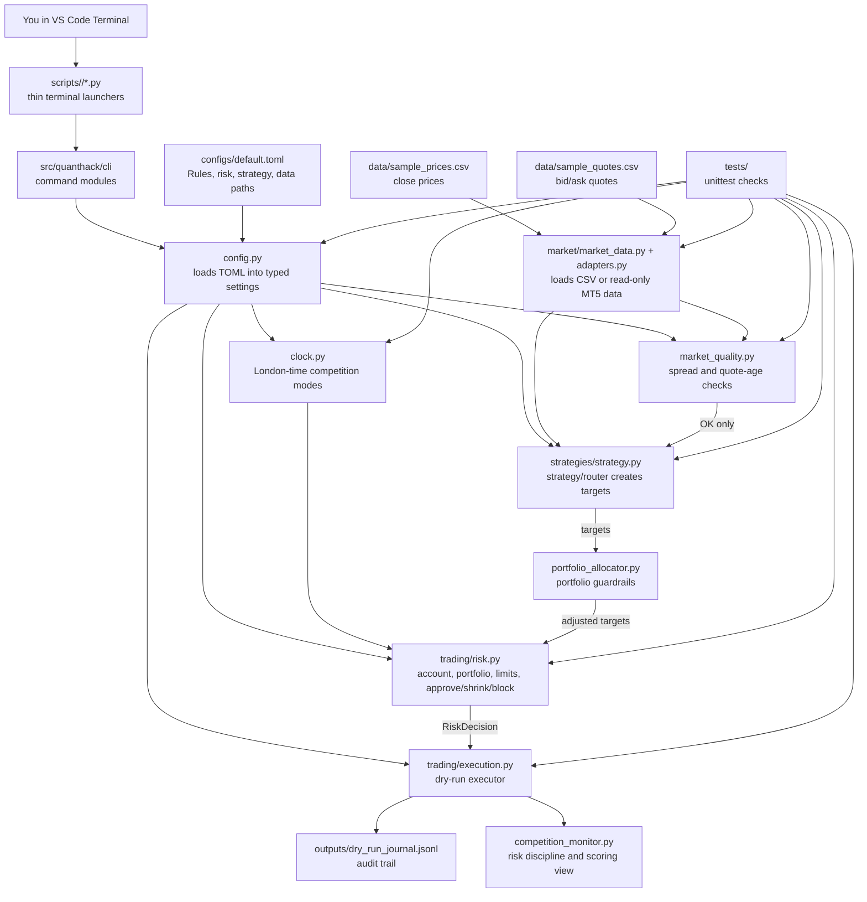
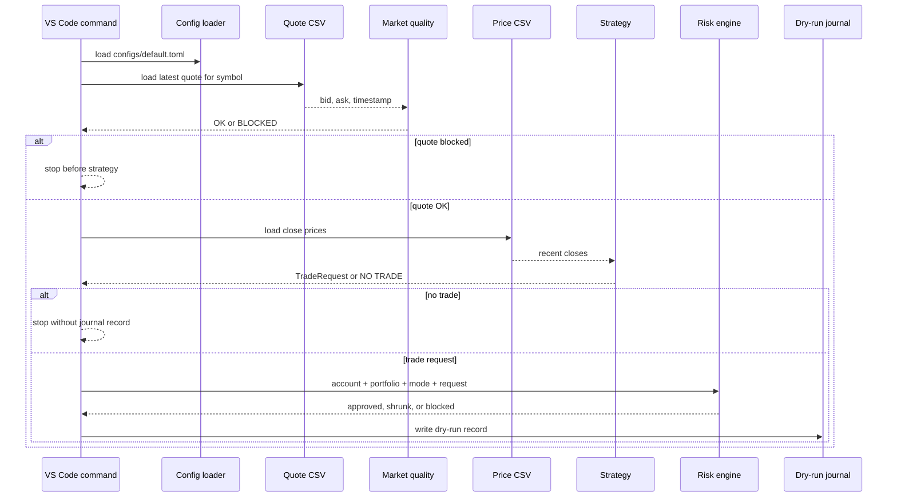

# Architecture And Next Steps

This document summarizes the project architecture. It started as the Step 10
architecture note and now also includes the later read-only MT5/live dry-run path.

The important idea is:

```text
Do not let a strategy trade directly.
```

Instead, every proposed action must pass through market quality checks, risk
checks, and dry-run journaling.

## Current Architecture



## Full Dry-Run Decision Flow



## What Each Layer Does

### Configuration

File:

```text
configs/default.toml
```

Purpose:

- Keeps hackathon assumptions visible.
- Stores London timezone and checkpoint times.
- Stores conservative risk limits.
- Stores strategy settings.
- Stores offline CSV paths.

Why it matters:

During the hackathon, we should tune config values before we rewrite code.

### Clock

File:

```text
src/quanthack/clock.py
```

Purpose:

- Knows London time.
- Detects `PRE_LIVE`, `QUALIFY`, `CHECKPOINT_PROTECT`, `FINAL_RANK_PUSH`, and
  `FINAL_SHARPE`.

Hackathon rule link:

Daily elimination/checkpoint windows are London-time sensitive. Risk should behave
differently near a checkpoint.

### Market Data

File:

```text
src/quanthack/market/market_data.py
src/quanthack/market/adapters.py
```

Purpose:

- Loads offline price CSV rows.
- Loads offline quote CSV rows.
- Provides a read-only MT5 adapter for ticks, bars, and account state.
- Rejects bad timestamps and invalid prices.

Hackathon rule link:

The project must not trade from malformed or timezone-ambiguous data.

### Market Quality

File:

```text
src/quanthack/market_quality.py
```

Purpose:

- Blocks stale quotes.
- Blocks quotes from the future.
- Blocks quotes with spreads above the configured limit.

Hackathon rule link:

Bad spreads or stale data can damage carried-over equity, especially near
elimination checkpoints.

### Strategy

File:

```text
src/quanthack/strategies/strategy.py
```

Purpose:

- Reads recent close prices.
- Measures strategy signals such as momentum, crossover, breakout, mean reversion,
  regime selection, and alpha-router votes.
- Emits desired target exposure or no action.

Important:

The strategy cannot execute anything. It only proposes.

### Risk

File:

```text
src/quanthack/trading/risk.py
```

Purpose:

- Tracks account state.
- Applies conservative internal limits.
- Approves, shrinks, or blocks a trade request.

Hackathon rule link:

The event allows up to 1:30 leverage, but our starter cap is 2x. The official
margin danger zone is not a target; our internal margin warning is much higher.

### Execution

File:

```text
src/quanthack/trading/execution.py
```

Purpose:

- Writes dry-run decisions to a JSONL journal.
- Does not place real or paper orders.

Important:

This is intentionally safe. The MT5 path is read-only and still fits behind the
same strategy, allocation, risk, and dry-run decision boundary.

## Main Commands Right Now

```bash
source .venv/bin/activate

python scripts/inspect/show_config.py
python scripts/inspect/show_prices.py
python scripts/inspect/show_quotes.py
python scripts/dry_run/quality_data_strategy_dry_run.py
python scripts/dry_run/live_dry_run.py --adapter csv --symbol EURUSD
python scripts/inspect/show_journal.py --limit 8
python -m unittest discover -s tests
```

## Current Safety Properties

- No order-sending broker path.
- Read-only MT5 mode is opt-in and requires `--confirm-read-only-mt5`.
- No MT5 order sending.
- No Syphonix API calls.
- No credentials in the repo.
- Strategy cannot bypass risk.
- Market quality can stop the system before strategy.
- Risk can shrink or block requests.
- Dry-run journal records accepted and blocked risk decisions.
- Tests cover clock, config, market data, MT5 adapter conversion, market quality,
  strategy, allocation, risk, execution, live dry-run, and monitoring.

## Current Limitations

- Sample data is fake and tiny.
- MT5 is read-only; there is still no live order executor.
- Syphonix-specific API docs are not wired directly.
- Strategy quality still depends on getting cleaner, larger FX/crypto data.
- The final official schedule still needs to be verified in the participant portal.

## Recommended Next Step

Step 12 is now a **preflight command**.

The command should answer:

```text
Am I ready to run this system safely right now?
```

It should check:

- Python environment is 3.11+.
- Config loads.
- London-time mode is shown.
- Price CSV exists and has enough rows.
- Quote CSV exists.
- Market quality passes for the configured symbol.
- Risk settings are conservative.
- Dry-run journal path is writable.
- Tests pass or at least the core checks pass.

Suggested command:

```bash
python scripts/setup/preflight.py
```

Expected output shape:

```text
Preflight
  Python: OK
  Config: OK
  Clock mode: PRE_LIVE
  Prices: OK
  Quotes: OK
  Market quality: OK
  Risk limits: OK
  Journal: OK
  Overall: READY_FOR_DRY_RUN
```

Why this should be next:

Before adding MT5 or any external platform, we want one command that tells us the
local system is coherent. This reduces confusion during the hackathon and gives us
a repeatable start-of-session checklist.

## Later Steps After Preflight

1. Add parameter sweeps and walk-forward evaluation for the backtester.
2. Add symbol metadata: min lot, tick size, contract size, and trading hours.
3. Run the read-only MT5 smoke loop once official credentials are available.
4. Add a read-only Syphonix/Symphonix adapter only after official docs are known.
5. Continue router and portfolio optimization only after the risk monitor stays clean.
