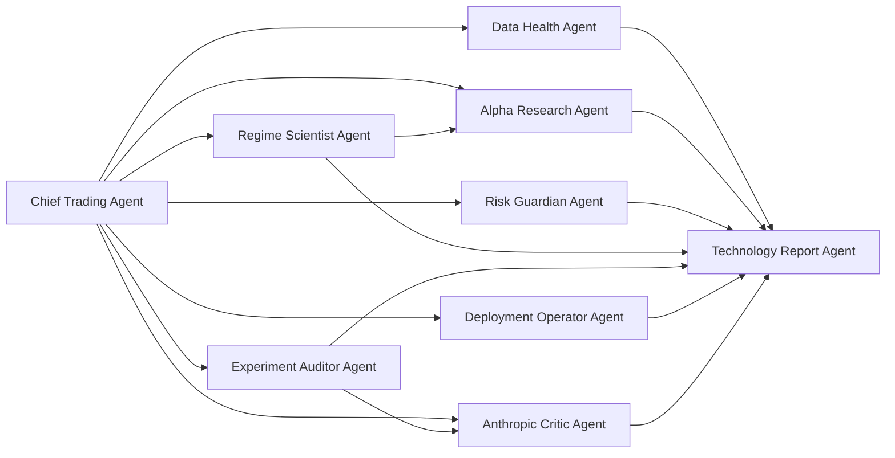

# AgentSDK Control Plane

This step adds a technology-prize layer on top of the trading engine.

The trading system already has strategies, backtests, risk gates, MT5 read-only
adapters, ticket sheets, and dashboards. The missing technical story was an
agentic control plane: a clear set of specialist agents that can inspect the
evidence, explain the strategy state, and prepare deployment artifacts without
silently bypassing risk rules.

## Why This Helps The Technology Prize

The separate technology prize is judged on how the system is built, not just
trading P&L. This layer shows:

- an AgentSDK-style multi-agent graph;
- read-only tool boundaries for research, risk, and deployment;
- explicit guardrails around MT5 and live trading;
- deterministic local execution for repeatable tests;
- an optional real Agents SDK bridge for a judge demo when API keys and credits
  are ready;
- an optional Anthropic critic layer for independent strategy/risk review when
  Anthropic credits are available;
- specialist regime-science and experiment-audit agents that turn the system
  into an AI-native research control plane rather than a script launcher.
- a requirement-level judge packet that verifies the AgentSDK, Anthropic,
  AI-native, provenance, and broker-safety claims against current artifacts.
- an executable guardrail suite covering read-only tools, path confinement,
  credit-spend arming, Anthropic review-only authority, and MT5 no-order
  boundaries.
- a self-validating AgentSDK topology report for tool coverage, handoff
  integrity, guardrail coverage, and authority separation.
- an offline AgentSDK-style trace replay for agent steps, tool calls,
  blackboard writes, and handoffs.
- a judge demo director that turns the evidence pack into a timed talk track,
  command sequence, proof map, and risk-answer sheet.
- a scored technology-prize rubric that maps AgentSDK use, Anthropic credits,
  AI-native innovation, technical reproducibility, safety, and demo readiness
  into one judge-facing PASS/WARN/FAIL scorecard.
- a skeptical judge red-team evaluator that rehearses hard questions about
  hidden order authority, AgentSDK centrality, Anthropic credit use, accidental
  model spend, provenance, and demo readiness.
- a safe offline demo rehearsal command that regenerates the judge-demo artifact
  flow before presentation.
- a final submission bundle command that regenerates the judge-facing artifacts
  in safe order and writes a single artifact index.

## Architecture



## Why This Is AI-Native And Innovative

This is AI-native because the core technology-prize layer is built around
model-facing agents, tools, guardrails, handoffs, critic loops, and provenance,
not because a model is sprinkled on top of a normal script.

The strongest claims are:

- Specialist agents decompose the system into data health, alpha research, risk,
  regime science, experiment audit, deployment, reporting, and independent
  critique.
- Agents use grounded read-only function tools that call real Claude Agent Trader modules.
- Anthropic credits are used for independent critique, not uncontrolled trading.
- Online model calls are guarded by explicit arming flags.
- MT5 remains outside the AI action boundary: agents can inspect ticket sheets
  but cannot place orders.
- Every judge-facing claim is backed by source/report hashes in the demo pack.
- The final judge packet turns the prize criteria into a PASS/WARN/FAIL
  evidence matrix, so the technical-merit story is machine-checkable.
- The guardrails are code, not just policy text: they can be run and attached
  to the judge packet.
- The AgentSDK graph is not merely drawn; topology checks prove tools are used,
  handoffs target real agents, and authority boundaries are encoded in the
  architecture.
- The local workflow is exported as trace-like spans, making agent reasoning
  inspectable without spending model credits.
- The demo itself is generated from system evidence, so the live presentation
  follows the same artifact trail judges can inspect.
- The scored rubric translates the architecture into the prize language, so a
  judge can quickly see why the build is technically strong beyond P&L.
- The red-team report turns likely judge objections into executable checks and
  demo-ready answers.
- The rehearsal report proves the live-demo sequence can be regenerated quickly
  without online model calls.
- The final submission bundle reduces demo risk by making one command refresh
  the dashboard, runbook, judge packet, and manifest before presentation.

## Main Files

- `src/quanthack/agents/technology_prize.py`
  - builds the deterministic local agent report;
  - detects whether the optional Agents SDK package is installed;
  - audits current research and deployment artifacts;
  - writes Markdown and JSON trace outputs.

- `src/quanthack/agents/sdk_bridge.py`
  - builds real Agents SDK `Agent` objects when the optional SDK is installed;
  - exposes read-only function tools;
  - deliberately does not run a live model call by default.

- `src/quanthack/agents/sdk_runner.py`
  - creates the guarded optional `Runner.run_sync` demo path;
  - refuses to run online unless explicitly armed;
  - writes a runner transcript without exposing live trading tools.

- `src/quanthack/cli/tech_prize_demo.py`
  - command-line entry point for the demo report.

- `src/quanthack/agents/demo_pack.py`
  - builds a judge-ready packet with scorecard checks, command recipes,
    source hashes, report hashes, and safety status.

- `src/quanthack/agents/workflow.py`
  - executes a deterministic local blackboard/handoff workflow across the
    specialist agents without spending model credits.

- `src/quanthack/agents/guardrails.py`
  - evaluates executable AI/broker guardrails for the AgentSDK tool surface,
    MT5 boundary, project-local path confinement, online credit spend, and
    Anthropic critic authority.

- `src/quanthack/agents/topology.py`
  - validates AgentSDK topology, including tool coverage, handoff targets,
    guardrail coverage, read-only tool authority, and Anthropic critic scope.

- `src/quanthack/agents/trace_replay.py`
  - exports the deterministic local workflow as AgentSDK-style spans for steps,
    tool calls, blackboard writes, and handoffs.

- `src/quanthack/agents/demo_director.py`
  - builds a timed judge runbook with exact commands, talk track, proofs, and
    risk answers.

- `src/quanthack/agents/submission_bundle.py`
  - builds the final technology-prize submission index and regenerates
    judge-facing artifacts in safe offline mode.

- `src/quanthack/agents/rubric.py`
  - scores the system against technology-prize axes for AgentSDK use,
    Anthropic credits, AI-native innovation, reproducibility, safety, and demo
    readiness;
  - writes a judge-facing Markdown/JSON rubric.

- `src/quanthack/agents/red_team.py`
  - challenges the technology-prize story with skeptical judge questions;
  - verifies answers against guardrails, topology, trace, rubric, runbook, and
    judge-packet evidence.

- `src/quanthack/agents/demo_rehearsal.py`
  - rehearses the safe offline judge-demo command flow;
  - checks that each command-equivalent step writes its expected artifacts.

- `src/quanthack/agents/judge_packet.py`
  - verifies technology-prize requirements against source, report, workflow,
    and safety evidence;
  - writes a judge-facing Markdown/JSON packet.

- `src/quanthack/cli/tech_prize_pack.py`
  - one-command entry point for the full demo packet.

- `src/quanthack/reporting/technology_prize_dashboard.py`
  - renders a standalone HTML dashboard from the demo pack.

- `src/quanthack/cli/tech_prize_dashboard.py`
  - one-command entry point for the browser-readable judge dashboard.

- `src/quanthack/cli/tech_prize_workflow.py`
  - one-command entry point for the local executable agent workflow trace.

- `src/quanthack/cli/tech_prize_guardrails.py`
  - one-command entry point for the executable AI/broker guardrail suite.

- `src/quanthack/cli/tech_prize_topology.py`
  - one-command entry point for the AgentSDK topology integrity report.

- `src/quanthack/cli/tech_prize_trace.py`
  - one-command entry point for the offline AgentSDK-style trace replay.

- `src/quanthack/cli/tech_prize_runbook.py`
  - one-command entry point for the timed judge demo runbook.

- `src/quanthack/cli/tech_prize_submit.py`
  - one-command entry point for the final submission bundle.

- `src/quanthack/cli/tech_prize_rubric.py`
  - one-command entry point for the scored technology-prize rubric.

- `src/quanthack/cli/tech_prize_red_team.py`
  - one-command entry point for skeptical judge red-team checks.

- `src/quanthack/cli/tech_prize_rehearse.py`
  - one-command entry point for the safe offline demo rehearsal.

- `src/quanthack/cli/tech_prize_judge_packet.py`
  - one-command entry point for the requirement-level judge packet.

## Judge Demo Pack

The fastest safe command for a judge demo is:

```bash
quanthack tech-prize-pack
```

It regenerates the component reports and writes:

- `outputs/reports/technology_prize_demo_pack.md`
- `outputs/reports/technology_prize_demo_pack.json`

The pack includes:

- a PASS/WARN/FAIL technology scorecard;
- local workflow steps, handoffs, and blackboard writes;
- source and report SHA-256 prefixes;
- exact demo commands;
- explicit credit-spend flags;
- safety claims around MT5, AgentSDK, and Anthropic.

For a browser-friendly version:

```bash
quanthack tech-prize-dashboard
```

It writes:

- `outputs/reports/technology_prize_dashboard.html`

This is the best first artifact to open for judges because it puts the scorecard,
agent graph, provider readiness, evidence table, provenance, and safe command
paths on one page.

To inspect the deterministic local workflow directly:

```bash
quanthack tech-prize-workflow
```

It writes:

- `outputs/reports/technology_prize_workflow.md`
- `outputs/reports/technology_prize_workflow.json`

This is the offline twin of the online AgentSDK path: it records the same agent
roles as concrete steps, blackboard writes, and handoffs without making model
calls.

To verify the exact technology-prize requirements:

```bash
quanthack tech-prize-judge-packet
```

It writes:

- `outputs/reports/technology_prize_judge_packet.md`
- `outputs/reports/technology_prize_judge_packet.json`

This is the final checklist artifact: it maps each judging claim to source
files, generated reports, hashes, and safety boundaries.

To score the system in the judge's prize language:

```bash
quanthack tech-prize-rubric
```

It writes:

- `outputs/reports/technology_prize_rubric.md`
- `outputs/reports/technology_prize_rubric.json`

The rubric gives a single PASS/WARN/FAIL status and 100-point score across best
use of AgentSDK, Additional Anthropic Credits, AI-native innovation, technical
merit, responsible trading safety, and demo readiness.

To rehearse skeptical judge questions:

```bash
quanthack tech-prize-red-team
```

It writes:

- `outputs/reports/technology_prize_red_team.md`
- `outputs/reports/technology_prize_red_team.json`

The red-team report checks whether the demo can answer the hard questions:
whether the AI can place trades, whether AgentSDK is central, how Anthropic
credits are used, whether model calls can spend credits accidentally, whether
the claims are backed by files, and whether the demo can be reproduced quickly.

To rehearse the safe offline demo flow:

```bash
quanthack tech-prize-rehearse
```

It writes:

- `outputs/reports/technology_prize_demo_rehearsal.md`
- `outputs/reports/technology_prize_demo_rehearsal.json`

The rehearsal regenerates the dashboard, demo pack, runbook, topology, trace,
guardrails, judge packet, rubric, and red-team report without online model
calls.

To run the guardrails directly:

```bash
quanthack tech-prize-guardrails
```

It writes:

- `outputs/reports/technology_prize_guardrails.md`
- `outputs/reports/technology_prize_guardrails.json`

To validate the AgentSDK topology directly:

```bash
quanthack tech-prize-topology
```

It writes:

- `outputs/reports/technology_prize_topology.md`
- `outputs/reports/technology_prize_topology.json`

To replay the local agent trace:

```bash
quanthack tech-prize-trace
```

It writes:

- `outputs/reports/technology_prize_trace_replay.md`
- `outputs/reports/technology_prize_trace_replay.json`

To generate the final timed demo script:

```bash
quanthack tech-prize-runbook
```

It writes:

- `outputs/reports/technology_prize_demo_runbook.md`
- `outputs/reports/technology_prize_demo_runbook.json`

To refresh everything for judging:

```bash
quanthack tech-prize-submit
```

It writes:

- `outputs/reports/technology_prize_submission.md`
- `outputs/reports/technology_prize_submission.json`

The submission bundle includes the dashboard, runbook, rehearsal, judge packet,
rubric, red-team report, demo pack, topology, trace replay, guardrails,
workflow, AgentSDK runner report, and Anthropic critic report.

## Command

```bash
PYTHONPATH=src .venv/bin/python -c 'from quanthack.cli.tech_prize_demo import main; main()'
```

or, after installing the project:

```bash
quanthack tech-prize-demo
```

The default outputs are:

- `outputs/reports/technology_prize_agent_report.md`
- `outputs/reports/technology_prize_agent_report.json`

## Optional Online SDK Runner

The online SDK runner is intentionally a second step. This avoids accidental
credit spend during normal backtesting.

Dry check, no online call:

```bash
quanthack tech-prize-demo --run-sdk
```

Actually arm the online Runner when `OPENAI_API_KEY` is configured:

```bash
quanthack tech-prize-demo \
  --run-sdk \
  --allow-online-sdk \
  --sdk-model gpt-5.5
```

The runner output goes to:

- `outputs/reports/technology_prize_sdk_runner.md`

The runner tools are read-only artifact summaries. It does not register an MT5
order placement tool.

## Optional Agents SDK Setup

The local report works without the SDK. When you want to demonstrate actual SDK
objects:

```bash
python -m pip install -e .[agent]
```

Then use `quanthack.agents.create_agents_sdk_app()` as the bridge from the
deterministic trading system into SDK agents and tools.

For the optional Anthropic critic package:

```bash
python -m pip install -e .[providers]
```

Set `ANTHROPIC_API_KEY` only when credits are available. The Anthropic critic
agent is a reviewer, not a trade approver.

Dry check, no online Anthropic call:

```bash
quanthack tech-prize-demo --run-anthropic-critic
```

Actually arm the Anthropic critic when `ANTHROPIC_API_KEY` is configured:

```bash
quanthack tech-prize-demo \
  --run-anthropic-critic \
  --allow-online-anthropic \
  --anthropic-model claude-sonnet-4-6
```

The critic output goes to:

- `outputs/reports/technology_prize_anthropic_critic.md`

The default bridge is still safe:

- it creates agents and tool wrappers;
- it does not place trades;
- it does not call MT5 order routing;
- it does not require live execution to pass tests.

The current AgentSDK bridge registers these read-only function tools:

- `summarize_research_artifacts`
- `summarize_csv`
- `validate_market_data_summary`
- `summarize_experiment_leaderboard`
- `build_hackathon_readiness_snapshot`
- `analyze_agent_topology`
- `build_judge_demo_runbook`
- `run_agent_guardrail_suite`
- `replay_agent_trace`
- `summarize_mt5_ticket_sheet`
- `summarize_operator_dashboard_sources`
- `build_technology_prize_judge_packet`

The demo pack verifies that the documented tool specs match the actual SDK
bridge registry.

## Demo Story

1. The Chief Trading Agent plans the run.
2. The Data Health Agent checks whether evidence artifacts exist.
3. The Alpha Research Agent summarizes the adaptive leaderboard and policy sweep.
4. The Risk Guardian Agent reviews oracle regret and handoff diagnostics.
5. The Regime Scientist Agent reviews selector regret and regime-transition evidence.
6. The Experiment Auditor Agent verifies hashes, command recipes, and evidence coverage.
7. The Deployment Operator Agent checks profile, monitor, and MT5 ticket outputs.
8. The Anthropic Critic Agent can independently critique overfitting and risk
   evidence when Anthropic credits are configured.
9. The Technology Report Agent writes a trace for judges.

That gives the project a clear technical narrative: the agent layer is not
random chatbot decoration. It supervises the actual trading pipeline and keeps
the live-trading boundary explicit.
